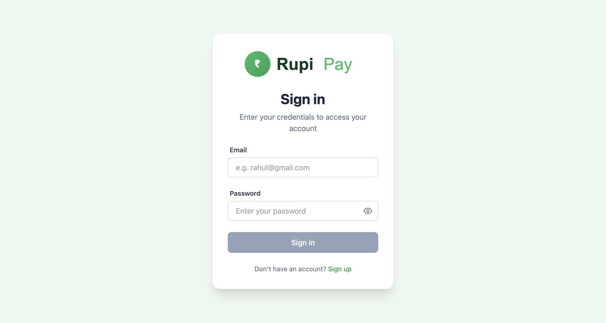
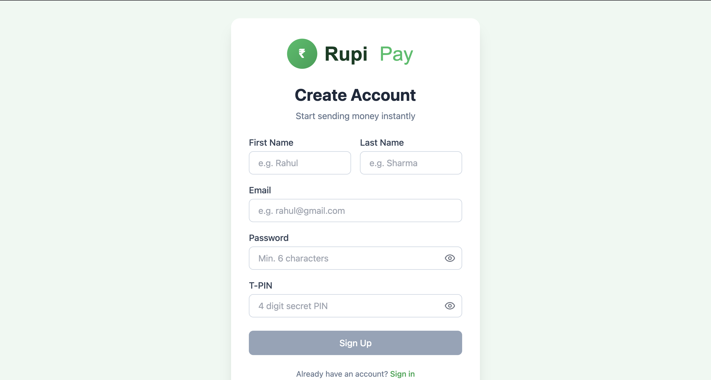
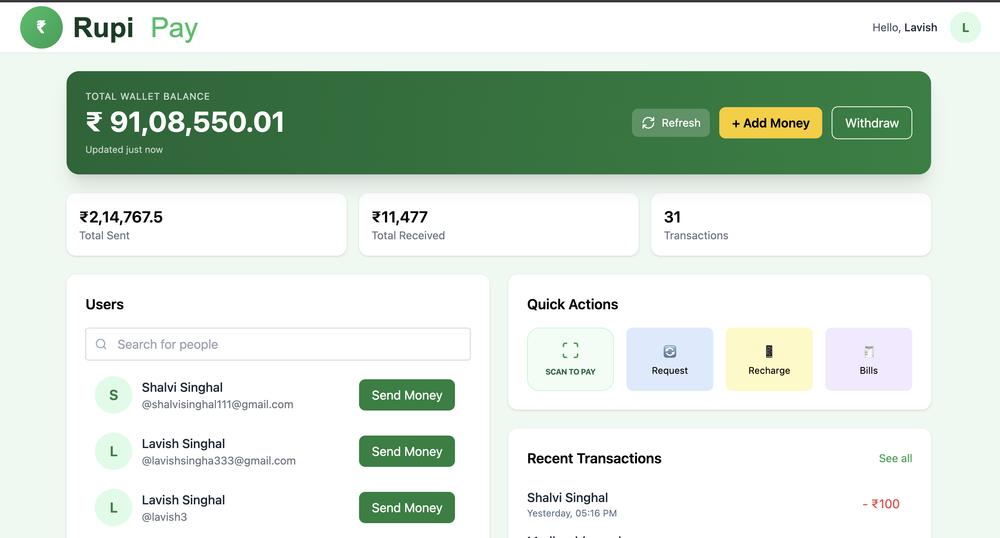
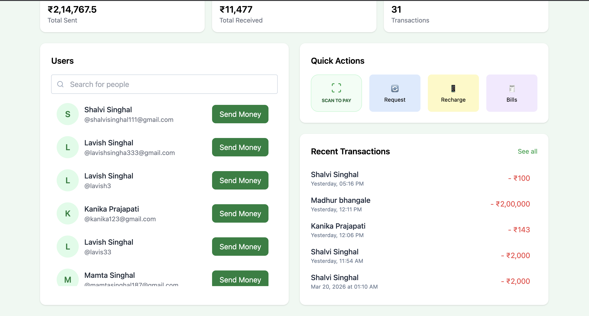
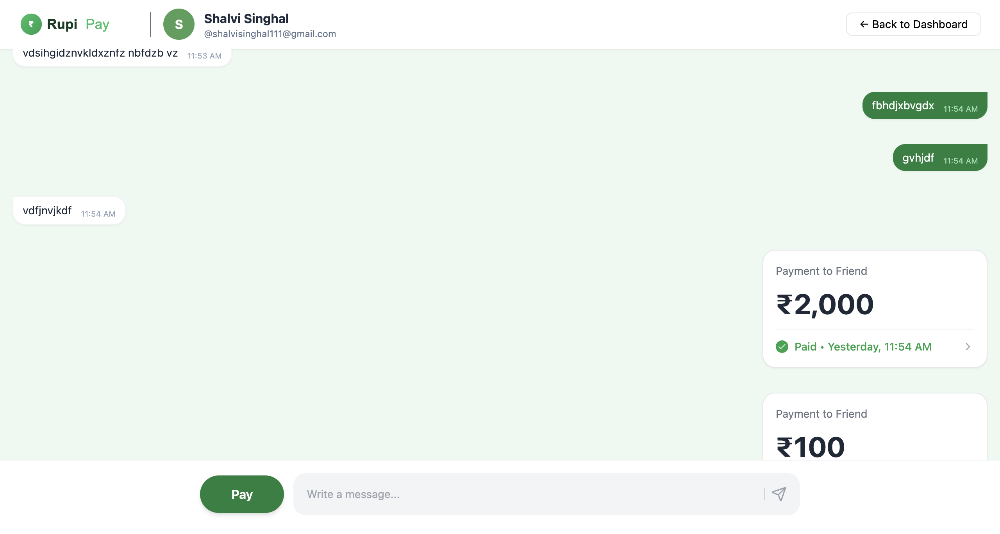
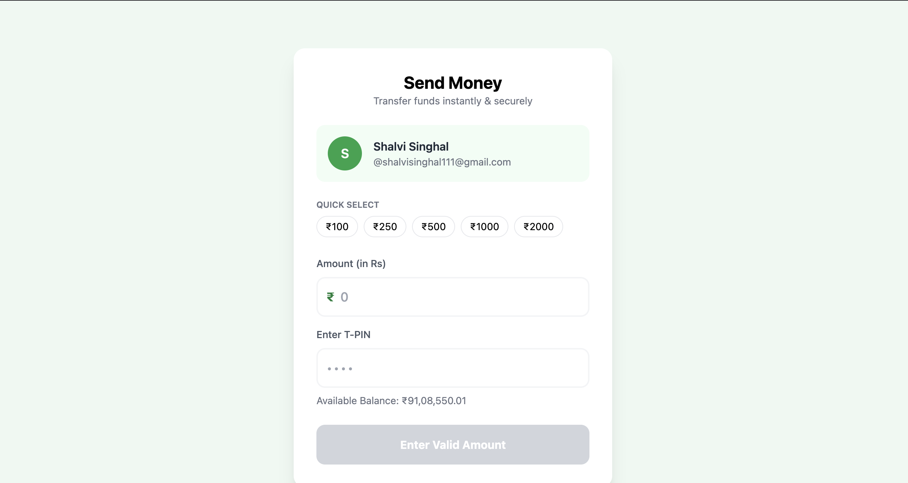
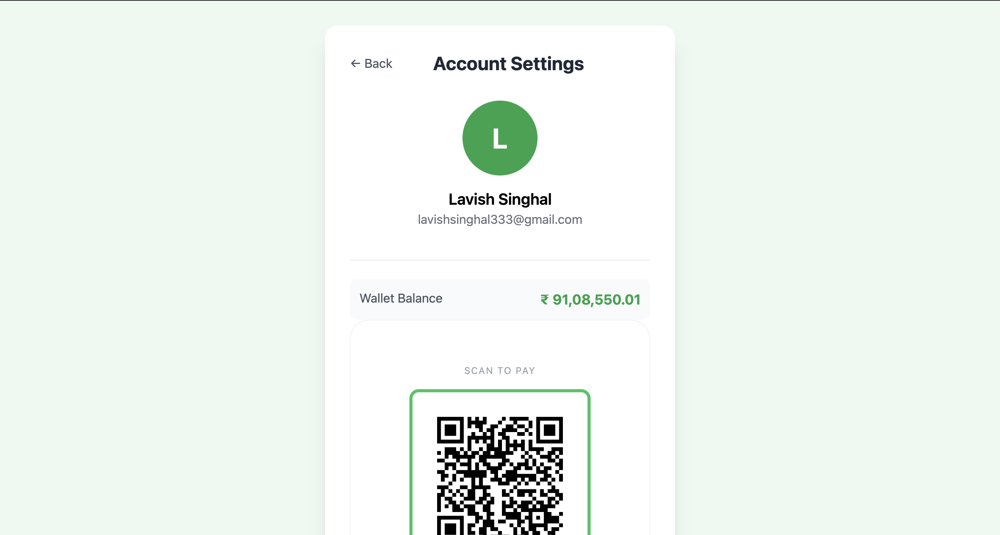
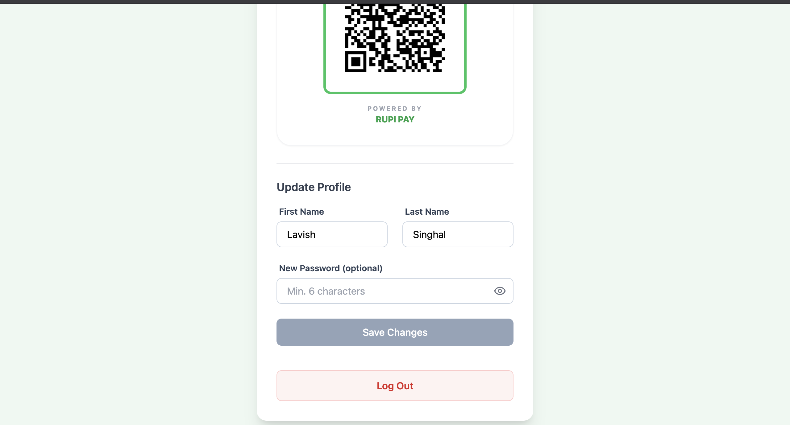
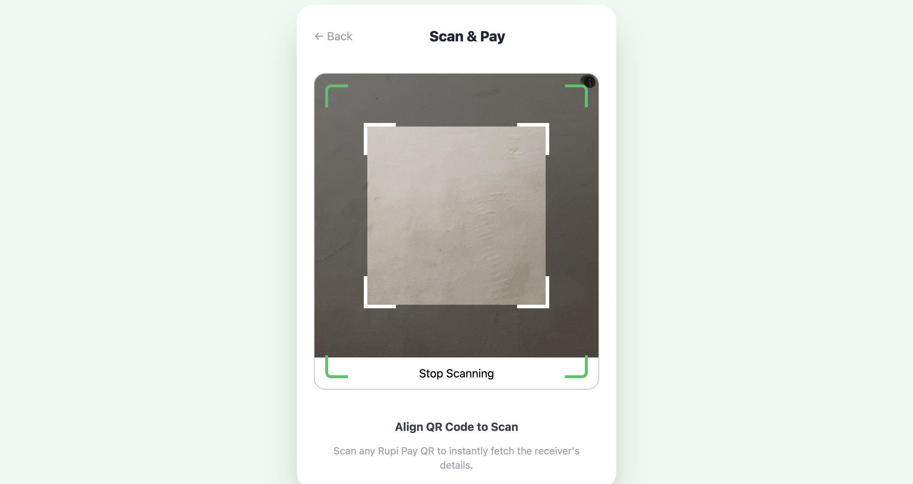

# Rupi Pay

Rupi Pay is a full-stack peer-to-peer payments app that combines wallet transfers, chat, QR-based payments, and transaction history in a single product flow.

The project is split into:

- `frontend/`: React + Vite + Tailwind client
- `backend/`: Node.js + Express + MongoDB API with Socket.io

## What It Does

- User signup, signin, logout, and profile updates
- Wallet balance view with sent/received transaction stats
- Search other users and start a chat
- Send money directly or from inside a conversation
- Generate a personal payment QR and scan another user's QR to pay
- Real-time chat delivery with Socket.io
- Transaction history, recent activity, and account totals

## Stack

- Frontend: React, Vite, Tailwind CSS, Axios, React Router, Socket.io Client
- Backend: Node.js, Express, Mongoose, Socket.io, Zod
- Database: MongoDB
- Auth: JWT + persisted session records

## Architecture Summary

- Authentication is token-based. Protected routes require `Authorization: Bearer <token>`.
- User sessions are stored in MongoDB and invalidated on logout.
- Account balances are stored in paise on the backend and exposed as rupees to the UI.
- Transfers run inside MongoDB transactions to keep sender and receiver balances consistent.
- Chat uses Socket.io for live delivery and MongoDB for chat history persistence.
- Payment events are stored as chat messages of type `PAYMENT`, so transfers can appear inside conversations.

## Repository Structure

```text
Rupi Pay/
├── backend/
│   ├── config.js
│   ├── db.js
│   ├── index.js
│   ├── middleware.js
│   ├── routes/
│   │   ├── account.js
│   │   ├── chat.js
│   │   ├── index.js
│   │   ├── transaction.js
│   │   └── user.js
│   └── README.md
├── frontend/
│   ├── public/
│   ├── src/
│   │   ├── assets/
│   │   ├── components/
│   │   ├── pages/
│   │   ├── App.jsx
│   │   ├── index.css
│   │   └── main.jsx
│   └── README.md
└── README.md
```

## Prerequisites

- Node.js 18+
- npm 9+
- MongoDB instance or MongoDB Atlas connection string

## Environment Variables

Create `backend/.env`:

```env
MONGO_URI=your_mongodb_connection_string
PORT=3000
JWT_SECRET=your_jwt_secret
```

The frontend currently calls the backend at `http://localhost:3000` directly in the source code, so no frontend `.env` is required for the current implementation.

## Install

```bash
cd backend
npm install

cd ../frontend
npm install
```

## Run Locally

Start the backend:

```bash
cd backend
npm start
```

Start the frontend in a second terminal:

```bash
cd frontend
npm run dev
```

Default local URLs:

- Frontend: `http://localhost:5173`
- Backend: `http://localhost:3000`

## Screenshots

Store README screenshots in `docs/screenshots/`.

Suggested files:

- `docs/screenshots/signin.png`
- `docs/screenshots/signup.png`
- `docs/screenshots/dashboard-overview.png`
- `docs/screenshots/dashboard-transactions.png`
- `docs/screenshots/chat-window.png`
- `docs/screenshots/send-money.png`
- `docs/screenshots/profile.png`
- `docs/screenshots/profile-update.png`
- `docs/screenshots/scan-to-pay.png`

### Sign In



### Sign Up



### Dashboard Overview



### Dashboard Activity



### Chat Window



### Send Money



### Profile



### Profile Update



### Scan To Pay



## Main Flows

### Auth

- Sign up with first name, last name, username, password, and 4-digit PIN
- Sign in to receive a JWT
- Logout invalidates the stored session token

### Wallet

- View available balance
- View total sent, total received, and total transaction count
- Browse recent and full transaction history

### Chat and Payments

- Search another user
- Open a chat thread
- Send text messages in real time
- Send money from the chat or the dedicated send-money screen
- Show payment activity as cards inside the conversation

### QR Payments

- Each user has a QR code derived from their username
- Scanning a QR resolves the user and opens the payment flow

## Notes

- Balances are stored as integers in paise internally.
- The backend allows only one active persisted session per user after signin.
- Socket.io CORS is configured for `http://localhost:5173`.
- The backend README and frontend README contain area-specific details.

## Documentation

- Backend guide: [backend/README.md](/Users/lavishsinghal/Desktop/Projects/Rupi%20Pay/backend/README.md)
- Frontend guide: [frontend/README.md](/Users/lavishsinghal/Desktop/Projects/Rupi%20Pay/frontend/README.md)
